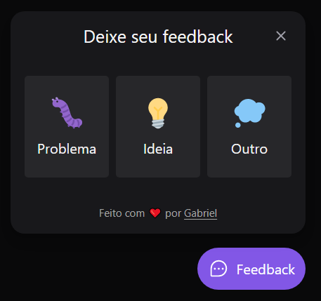
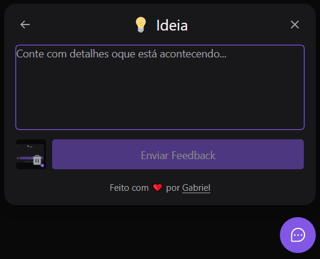

## NLW Return

<div align="center">
    
</div>

<p align="center">
    
    <a href="">
        </img>
    </a>
    
    <a href="https://github.com/GabrielMedradoS/NLW---Return-/blob/master/License">
        
    </a>
</p>

<p align="center">
    <a href="#projeto-">Projeto</a> &nbsp;&nbsp;&nbsp;|&nbsp;&nbsp;&nbsp;
    <a href="#tecnologias-">Tecnologias</a> &nbsp;&nbsp;&nbsp;|&nbsp;&nbsp;&nbsp;
    <a href="#layout-">Layout</a> &nbsp;&nbsp;&nbsp;|&nbsp;&nbsp;&nbsp;
    <a href="#licença-%EF%B8%8F">Licença</a>
</p>

### Layout 🚧

#### Desktop Screenshot:

<div align='center'>


</div>

#### Mobile Screenshot:

<div align='center'>


</div>

## Projeto 💻

- Conteúdo de aulas praticas da Rocketseat com o instrutor Diego Fernandes
- Projeto consiste em fazer um Widget com feedback, screenshot relatando bugs ou ideias para o App

## Rodar o projeto 🚴🏻‍♂️

#### On your machine:

##### Front-end

<details>
    <summary>Dependencies</summary>

```json
  "dependencies": {
    "@headlessui/react": "^1.6.6",
    "phosphor-react": "^1.4.1",
    "react": "^18.2.0",
    "react-dom": "^18.2.0"
  },
  "devDependencies": {
    "@tailwindcss/forms": "^0.5.2",
    "@types/react": "^18.0.15",
    "@types/react-dom": "^18.0.6",
    "@vitejs/plugin-react": "^2.0.0",
    "autoprefixer": "^10.4.8",
    "postcss": "^8.4.16",
    "tailwind-scrollbar": "^1.3.1",
    "tailwindcss": "^3.1.8",
    "typescript": "^4.6.4",
    "vite": "^3.0.9"
  }
```

</details>

```bash
# Clone the repository
$ git clone https://github.com/GabrielMedradoS/NLW---Return-.git

# Access the project folder at the command prompt
$ cd return/web

# Install the dependencies
$ npm install

# Run the script "start"
$ npm run dev

# The project will start at the door: 5173 - access http://localhost:5173
```

##### Back-end

<details>
    <summary>Dependencies</summary>

```json
  "scripts": {
    "dev": "ts-node-dev src/server.ts",
    "test": "jest"
  },
  "devDependencies": {
    "@swc/core": "^1.2.242",
    "@swc/jest": "^0.2.22",
    "@types/cors": "^2.8.12",
    "@types/express": "^4.17.13",
    "@types/jest": "^28.1.8",
    "@types/node": "^18.7.9",
    "@types/nodemailer": "^6.4.5",
    "jest": "^29.0.0",
    "prisma": "^4.2.1",
    "ts-node": "^10.9.1",
    "ts-node-dev": "^2.0.0",
    "typescript": "^4.7.4"
  },
  "dependencies": {
    "@prisma/client": "^4.2.1",
    "cors": "^2.8.5",
    "express": "^4.18.1",
    "nodemailer": "^6.7.8"
  }
```

</details>

```bash
# Clone the repository
$ git clone https://github.com/GabrielMedradoS/NLW---Return-.git

# Access the project folder at the command prompt
$ cd return/server

# Install the dependencies
$ npm install

# Run the script "start"
$ npm run dev

# The project will start at the door: 3333 - access http://localhost:3333
```

##### Mobile

<details>
    <summary>Dependencies</summary>

```json
  "scripts": {
    "start": "expo start",
    "android": "expo start --android",
    "ios": "expo start --ios",
    "web": "expo start --web"
  },
  "dependencies": {
    "@expo-google-fonts/inter": "^0.2.2",
    "@gorhom/bottom-sheet": "^4",
    "axios": "^0.27.2",
    "expo": "~46.0.9",
    "expo-app-loading": "~2.1.0",
    "expo-file-system": "~14.1.0",
    "expo-font": "~10.2.0",
    "expo-status-bar": "~1.4.0",
    "phosphor-react-native": "^1.1.2",
    "react": "18.0.0",
    "react-dom": "18.0.0",
    "react-native": "0.69.5",
    "react-native-gesture-handler": "~2.5.0",
    "react-native-iphone-x-helper": "^1.3.1",
    "react-native-reanimated": "~2.9.1",
    "react-native-svg": "12.3.0",
    "react-native-view-shot": "3.3.0",
    "react-native-web": "~0.18.7"
  },
  "devDependencies": {
    "@babel/core": "^7.12.9",
    "@types/react": "~18.0.14",
    "@types/react-native": "~0.69.1",
    "typescript": "~4.3.5"
  },
```

</details>

```bash
# Clone the repository
$ git clone https://github.com/GabrielMedradoS/NLW---Return-.git

# Access the project folder at the command prompt
$ cd return/mobile

# Install the dependencies
$ npm install

# Run the script "start"
$ npm run start

# The project start and generate a Qr Code
```

## Tecnologias 🛠

<div>
  
  
  
  
  
  
  
</div>

#### documentation 📜

_`Aula 1 :`_

- [Tailwind | documentation](https://tailwindcss.com/)
- [Vite | documentation](https://vitejs.dev/)

_`Aula 2 :`_

- [Tailwind | forms](https://github.com/tailwindlabs/tailwindcss-forms)
- [Tailwind | scrollbar](https://www.npmjs.com/package/tailwind-scrollbar)
- [html2canvas](https://html2canvas.hertzen.com/)

_`Aula 3 :`_

- [express](https://www.npmjs.com/package/express)
- [Prisma | documentation](https://www.prisma.io/)
- [Prisma | SQLite](https://www.prisma.io/docs/concepts/database-connectors/sqlite)
- [mailtrap | Sandbox Service](https://mailtrap.io/)
- [SOLID](https://www.youtube.com/watch?v=vAV4Vy4jfkc&ab_channel=Rocketseat)
- [Jest | swc](https://swc.rs/docs/usage/jest)

_`Aula 4 :`_

- [React Native](https://reactnative.dev/docs/environment-setup)
- [Expo](https://expo.dev/)
- [Expo | Google fonts](https://docs.expo.dev/guides/using-custom-fonts/)
- [Bottom Sheet](https://gorhom.github.io/react-native-bottom-sheet/)
- [Expo | reanimated](https://docs.expo.dev/versions/latest/sdk/reanimated/)
- [Expo | gesture-handler](https://docs.expo.dev/versions/latest/sdk/gesture-handler/)
- [RN | View-shot](https://docs.expo.dev/versions/latest/sdk/captureRef/)
- [axios](https://axios-http.com/ptbr/docs/instance)

## Licença ⚖️

This project is under the MIT license. See the archive [LICENSE](https://github.com/GabrielMedradoS/NLW---Return-/blob/master/License) for more details.

## Autor ✍🏾

| <a href="https://github.com/gabrielmedrados/"><br>
| :-------------------------: |
| <a href="https://github.com/gabrielmedrados/"> Gabriel Medrado |</a> |

[](https://www.linkedin.com/in/gabriel-medrado-de-souza-9a30b3206/)
[](mailto:gabriel.medradoo@hotmail.com)
